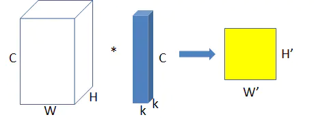
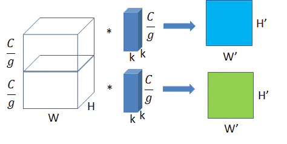

[循环神经网络入门](http://colah.github.io/posts/2015-08-Understanding-LSTMs/)

# 卷积神经网络

## 资料

> 各种卷积的动图

https://github.com/vdumoulin/conv_arithmetic/tree/master/gif

## 卷积与全连接

> 全连接

神经网络相邻层的节点是全连接的，也就是输出层的每个节点会与输入层的所有节点连接。

> 卷积

- 局部连接
- 权值共享

具体来说，卷积层是通过特定数目的卷积核（又称滤波器）对输入的多通道（channel）特征图进行扫描和运算，从而得到多个拥有更高层语义信息的输出特征图（通道数目等于卷积核个数）。图1.2形象地描绘了卷积操作的基本过程：下方的绿色方格为输入特征图，带灰色阴影部分是卷积核施加的区域；卷积核不断地扫描整个输入特征图，最终得到输出特征图，也就是上方的棕色方格。需要说明的是，输入特征图四周的虚线透明方格，是卷积核在扫描过程中，为了保证输出特征图的尺寸满足特定要求，而对输入特征图进行的边界填充（padding），一般可以用全零行/列来实现。

- 局部连接：卷积核尺寸远小于输入特征图的尺寸，输出层上的每个节点都只与输入层的部分节点连接
- 权值共享：卷积核的滑动窗机制，使得输出层上不同位置的节点与输入层的连接权值都是一样的（即卷积核参数）。而在全连接层中，不同节点的连接权值都是不同的。

- 输入/输出数据的结构化：全连接（将图片展平成一维数组）会破坏图片的空间信息，而卷积运算可以保留图片的空间信息。

## 感受野

对于某层输出特征图上的某个点，在卷积神经网络的原始输入数据上能影响到这个点的取值的区域。通俗来说就是，当前特征图中的像素点，对应到的原图的那块像素区域。

- $3*3$的卷积核，步长为1.

## 卷积核参数计算

- $(卷积核w*卷积核h*输入通道+偏置)*输出通道$

​				 

$$
Non-bottlenck：(3*3*w+1)*w+(3*3*w+1)*w = 18w^2 + 2w = 18w_0^2 + 2w_0
$$

$$
Bottlenck：(1*1*w+1)*\frac{w}{4} +(3*3*\frac{w}{4} + 1)*\frac{w}{4} + (1*1\frac{w}{4} + 1)*w = \frac{17w^2}{16}+ \frac{3w}{2} = 17w_0^2+ 6w_0
$$

$$
Non-bt-1D：(3*1*w+1)*w+(1*3*w+1)*w+(3*1*w+1)*w+(1*3*w+1)*w=12w^2+4w=12w_0^2+4w_0
$$

## 卷积核变种

> 普通卷积

一个卷积与所有通道都进行运算。

> 分组卷积（Group Convolution）

将输入特征/图片的通道分成组，每个卷积核也相应地分成组，在对应的组内做卷积。图中分组数，即上面的一组feature map只和上面的一组卷积核做卷积，下面的一组feature map只和下面的一组卷积核做卷积。每组卷积都生成一个feature map，共生成两个feature map。

> 转置卷积/反卷积(Transposed Convolution)

<a href="https://zhuanlan.zhihu.com/p/115070523#:~:text=%E8%BD%AC%E7%BD%AE%E5%8D%B7%E7%A7%AF%EF%BC%88Transpose,Convolution%EF%BC%89%EF%BC%8C%E4%B8%80%E4%BA%9B%E5%9C%B0%E6%96%B9%E4%B9%9F%E7%A7%B0%E4%B8%BA%E2%80%9C%E5%8F%8D%E5%8D%B7%E7%A7%AF%E2%80%9D%EF%BC%8C%E5%9C%A8%E6%B7%B1%E5%BA%A6%E5%AD%A6%E4%B9%A0%E4%B8%AD%E8%A1%A8%E7%A4%BA%E4%B8%BA%E5%8D%B7%E7%A7%AF%E7%9A%84%E4%B8%80%E4%B8%AA%E9%80%86%E5%90%91%E8%BF%87%E7%A8%8B%EF%BC%8C%E5%8F%AF%E4%BB%A5%E6%A0%B9%E6%8D%AE%E5%8D%B7%E7%A7%AF%E6%A0%B8%E5%A4%A7%E5%B0%8F%E5%92%8C%E8%BE%93%E5%87%BA%E7%9A%84%E5%A4%A7%E5%B0%8F%EF%BC%8C%E6%81%A2%E5%A4%8D%E5%8D%B7%E7%A7%AF%E5%89%8D%E7%9A%84%E5%9B%BE%E5%83%8F%E5%B0%BA%E5%AF%B8%EF%BC%8C%E8%80%8C%E4%B8%8D%E6%98%AF%E6%81%A2%E5%A4%8D%E5%8E%9F%E5%A7%8B%E5%80%BC%E3%80%82">参考文章</a>

- 卷积的反操作。卷积是提取特征，反卷积是还原图片。
- 下面这个示意图就是一种反卷积。把原来$2*2$的图片还原成$4*4$的

> 空洞卷积（Dilated/Atrous Convolution）

是在标准的 convolution map 里注入空洞，以此来增加 reception field。相比原来的正常convolution，dilated convolution 多了一个 hyper-parameter 称之为 dilation rate 指的是kernel的间隔数量(e.g. 正常的 convolution 是 dilatation rate 1)。

- 空洞卷积示例

卷积核没有红点标记位置的为0，红点标记位置同正常卷积核。

在语义分割（Semantic Segmentation）任务中，一般需要先缩小特征图尺寸，做信息聚合；然后再复原到之前的尺寸，最终返回与原始图像尺寸相同的分割结果图。常见的语义分割模型，如全卷积网络（FCN），一般采用池化操作（pooling）来扩大特征图的感受野，但这同时会降低特征图的分辨率，丢失一些信息（如内部数据结构、空间层级信息等），导致后续的上采样操作（如转置卷积）无法还原一些细节，从而限制最终分割精度的提升。

----

空洞卷积就是在标准的卷积核中注入“空洞”，以增加卷积核的感受野。空洞卷积引入了扩张率（dilation rate）这个超参数来指定相邻采样点之间的间隔：扩张率为$r$的空洞卷积，卷积核上相邻数据点之间有$r-1$个空洞，如图1.7所示（图中有绿点的方格表示有效的采样点，黄色方格为空洞）。尺寸为$k_w*k_h$的标准卷积核，其所对应的扩张率为$r$的空洞卷积核尺寸为 $k_e+(r-1)(k_e-1),e∈{w，h}$。特别地，扩张率为1的空洞卷积实际上就是普通卷积（没有空洞）。

> 可变形卷积（DeformableConvolution）

普通的卷积操作是在固定的、规则的网格点上进行数据采样，如图1.8（a）所示，这束缚了网络的感受野形状，限制了网络对几何形变的适应能力。为了克服这个限制，可变形卷积在卷积核的每个采样点上添加一个可学习的偏移量（offset），让采样点不再局限于规则的网格点，如图1.8（b）所示。图1.8（c）和图1.8（d）是可变形卷积的两个特例：前者在水平方向上对卷积核有较大拉伸，体现了可变形卷积的尺度变换特性；后者则是对卷积核进行旋转。特别地，图1.8（c）中的可变形卷积核有点类似于上一问中的空洞卷积；实际上，空洞卷积可以看作一种特殊的可变形卷积。

## CNN整体结构

### `AlexNet`

主要网络结构是堆砌的卷积层和池化层，最后在网络末端加上全连接层和softmax层以处理多分类任务。

- 采用了ReLU（修正线性单元，Rectified Linear Unit）作为激活函数，替换了之前的sigmoid函数，缓解了深层网络训练时梯度消失问题。
- 引入了局部响应归一化（Local Response Normalization, LRN）模块。
- 应用了Dropout和数据扩充（data augmentation）技术来提升训练效果。
- 用分组卷积来突破当时GPU的显存瓶颈。

### `VGGNet`

相比于AlexNet，VGGNet做了如下改变。

- 用多个$3*3$小卷积核代替之前的$5*5$、$7*7$等大卷积核，这样可以在更少的参数量、更小的计算量下，获得同样的感受野以及更大的网络深度。
- 用$2*2$池化核代替之前的$3*3$池化核。
- 去掉了局部响应归一化模块。

整体来说，VGGNet网络结构设计更加简洁，整个网络采用同一种卷积核尺寸（$3*3$）和池化核尺寸（$2*2$），并重复堆叠了很多基础模块，最终的网络深度也达到了近20层。

### `inception-v1`

在VGGNet简单堆砌$3*3$卷积的基础上，Inception系列网络深入地探索了网络结构的设计原则。

参考文献[12]认为，网络性能和表达能力正相关于网络规模，即网络深度和宽度；但过深或过宽的网络会导致参数量非常庞大，这会进一步带来诸如过拟合、梯度消失或爆炸、应用场景受限等问题。一种改进手段是将当前网络中的全连接和卷积等密集连接结构转化为稀疏连接形式，这可以降低计算量，同时维持网络的表达能力。

据此，Inception系列网络提出了Inception模块，它将之前网络中的大通道卷积层替换为由多个小通道卷积层组成的多分支结构。

Inception模块会同时使用$1*1$, $3*3$, $5*5$的3种卷积核进行多路特征提取，这样能使网络稀疏化的同时，增强网络对多尺度特征的适应性。

> Inception-v1在网络结构设计上的创新。

- 提出了瓶颈（bottleneck）结构，即在计算比较大的卷积层之前，先使用$1*1$卷积对其通道进行压缩以减少计算量（在较大卷积层完成计算之后，根据需要有时候会再次使用$1*1$卷积将其通道数复原），如图1.11（b）所示。
- 从网络中间层拉出多条支线，连接辅助分类器，用于计算损失并进行误差反向传播，以缓解梯度消失问题。
- 修改了之前`VGGNet`等网络在网络末端加入多个全连接层进行分类的做法，转而将第一个全连接层换成全局平均池化层（Global Average Pooling）

### `Inception-v2/v3`

Inception-v2/v3是在同一篇论文里提出的，参考文献[13]中提出了4点关于网络结构设计的准则。

- 避免表达瓶颈（representational bottleneck），尤其是在网络的前几层。具体来说，将整个网络看作由输入到输出的信息流，我们需要尽量让网络从前到后各个层的信息表征能力逐渐降低，而不能突然剧烈下降或是在中间某些节点出现瓶颈。
- 特征图通道越多，能表达的解耦信息就越多，从而更容易进行局部处理，最终加速网络的训练过程。
- 如果要在特征图上做空间域的聚合操作（如$3*3$卷积），可以在此之前先对特征图的通道进行压缩，这通常不会导致表达能力的损失。
- 在限定总计算量的情况下，网络结构在深度和宽度上需要平衡。

图1.12展示了各版本Inception模块的结构示意图，图1.12（a）是Inception-v1中使用的原始Inception模块；图1.12（b）、图1.12（c）、图1.12（d）是Inception-v2/v3中使用的、经过卷积分解的Inception模块，分别是Inception-A（将大卷积核分解为小卷积核）、Inception-B（串联[插图]和[插图]卷积）和Inception-C（并联[插图]和[插图]卷积）。为了缓解单纯使用池化层进行下采样带来的表达瓶颈问题，文中还提出了一种下采样模块：在原始Inception模块的基础上略微修改，并将每条支路最后一层的步长改为2，如图1.13所示。

图 1.12 inception模块及其卷积分解后的变种：Inception A/B/C模块

----

图 1.13 inception-v2/v3中的下采样模块

### `ResNet`

ResNet[14]的提出源于这样一种现象：随着网络层数的加深，网络的训练误差和测试误差都会上升。这种现象称为网络的退化（degeneration），它与过拟合显然是不同的，因为过拟合的标志之一是训练误差降低而测试误差升高。为解决这个问题，ResNet采用了跳层连接（shortcut connection），即在网络中构筑多条“近道”，这有以下两点好处。

- 能缩短误差反向传播到各层的路径，有效抑制梯度消失的现象，从而使网络在不断加深时性能不会下降。
- 由于有“近道”的存在，若网络在层数加深时性能退化，则它可以通过控制网络中“近道”和“非近道”的组合比例来退回到之前浅层时的状态，即“近道”具备自我关闭能力。

ResNet的跳层连接，使得现有网络结构可以进一步加深至百余层甚至千余层，而不用担心训练困难或性能损失。在实际应用中，ResNet-152模型在ImageNet 2012数据集的图像分类任务上，单模型能使Top-5错误率降至4.49%，采用多模型集成可进一步将错误率降低到3.57%。

## 批归一化

主要作用是确保网络中的各层，即使参数发生了变化，其输入/输出数据的分布也不能产生较大变化，从而避免发生内部协变量偏移现象。采用批归一化后，深度神经网络的训练过程更加稳定，对初始值不再那么敏感，可以采用较大的学习率来加速收敛。

# 计算机视觉

## 物体检测

CV中的基础问题，解决实例分割（Instance Segmentation）、场景理解（Scene Understanding）、目标跟踪（Object Tracking）、图像标注（Image Captioning）等问题的基础。

> 物体检测/目标检测

检测输入图像中是否存在给定类别的物体。若存在，则输出物体在图像中的位置信息，一般这个位置信息是矩形框。

> 分类

- 单步模型
    - 没有独立的、显示的提取候选区域（region proposal），直接由输入图像得到其中存在地物体的类别和位置信息的模型。
    - 典型的单步模型有：OverFeat、SSD、YOLO系列模型等。
- 两步模型
    - 有独立的、显示的提取候选区域（region proposal）提取过程，即先在输入图像上筛选出一些可能存在的物体的候选区域，然后针对每个候选区域，判断其是否存在物体，若存在，就给出物体的类别和位置修正信息。
    - 典型的两步模型有：R-CNN、SPPNet、Fast R-CNN、Faster R-CNN、R-FCN、Mask R-CNN等。

- 对比
    - 一般，单步模型速度快，精度比两步模型稍低。

## 语义分割

### `基于编码解码`

> `FCN`

> `UNet`

### `DeepLab系列`

> `DeepLab v1`

- 创新
    - 空洞卷积
    - 全连接条件随机场（CRF）

- 空洞卷积解决了编码过程中信号不断被下采样、细节信息丢失的问题。
- CRF提高模型捕获局部结构信息的能力。
    - 将每一个像素作为CRF的一个节点，像素与像素间的关系作为边，来构造基于全图的CRF。

> `DeepLab v2`

> `DeepLab v3`

> `DeepLab v3+`

